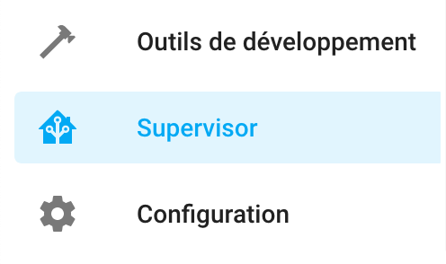
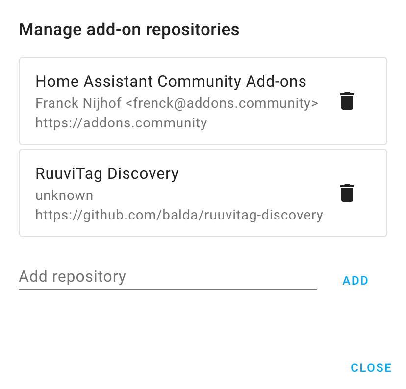
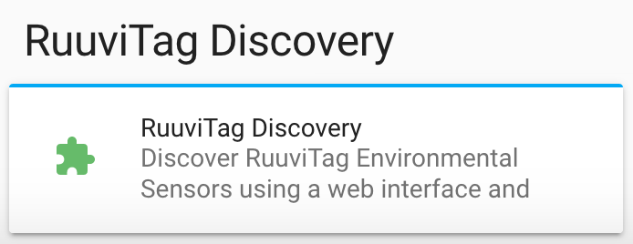

# RuuviTag Discovery

Discover [RuuviTag Environmental Sensors](https://ruuvi.com/) using a web interface (all measures in one page).

Save measures to multiple targets:

- [MQTT](http://mqtt.org/)
- [InfluxDB](https://docs.influxdata.com/influxdb/)
- [Graphite](https://graphite.readthedocs.io/en/latest/)
- [Home Assistant](https://www.home-assistant.io/hassio/) (using [MQTT discovery](https://www.home-assistant.io/docs/mqtt/discovery/) integration)

Other Features:

- Select and configure measures sent to each target
- Additional measures: absolute humidity, acceleration, air density, battery level, dew point, equilibrium vapor pressure, vapor pressure deficit, reception frequency and reception period
- Sampling configuration (median measures)
- Broadcast live or sampled measures
- [Home Assistant](https://www.home-assistant.io/hassio/) add-on


## Install

### From source

```bash
npm install
npm start
```

Web interface url: http://localhost:8099/

Configuration is save in `/data/` directory (create on first run)

### [Home Assistant](https://www.home-assistant.io/hassio/) add-on

In the sidebar menu, click on **Supervisor** page.



Navigate to **Add-on store** panel and click on **Repositories** menu on the right.


Copy and paste this repository url `https://github.com/balda/ruuvitag-discovery` and click on **Add**.



On the bottom off the Add-on store page, click on **RuuviTag Discovery**.



**Install** (can be long) and activate **Show in sidebar** option.

Once installed, web UI is available in the sidebar and you can start to view RuuviTags measures and to configure targets.


## Configuration

All the configuration is done in the web interface and saved in `/data/config.json` file.


### Global configuration

#### History

Default configuration retain 100 measures max per RuuviTag (`history` config). History is used to calculate `frequency` (number of measures read per minute) and `period` (time in seconds between measures read). `samples` additional measure count measures in tag history.

#### Sampling

Default sampling is every 10 seconds (`interval` config). Setting `interval = O` disable sampling (last measures are always sent).

If sampling is enable, `median` measures are sent to non live targets (see targets below)

#### Battery level

Battery level is between 1% and 100%, for respectivly 2500mV (`min` config) and 3000mV (`max` config).

_See [battery FAQ](https://github.com/ruuvi/ruuvitag_fw/wiki/FAQ:-battery) in RuuviTag firmware repository._


### Measures

#### Available measures

##### RuuviTag environmental sensors

See [Ruuvi sensor protocols](https://github.com/ruuvi/ruuvi-sensor-protocols/) to view available measures. Data format 3 and 5 are supported. Data format 1, 2 and 4 are not tested.

- Temperature
- Pressure
- Humidity
- RSSI
- Battery voltage
- Acceleration X
- Acceleration Y
- Acceleration Z
- Tx power (data format 5)
- Movement counter (data format 5)
- Measurement sequence number (data format 5)
- Data format

##### Additional measures

Calculated using default measures

- Absolute humidity
- Acceleration
- Air density
- Battery level
- Dew point
- Equilibrium vapor pressure
- Vapor pressure deficit


### Targets

Measures can be sent in live to a target by setting `interval = 0`. Otherwise, every `interval` seconds, `median` measures are sent (or last measures if sampling is disabled).

All targets have a name and can be enabled or disabled.

Some targets have a `measurement` option:

- `Tag`: all measures are sent (using RuuviTag `field`)
- `Measure`: each measure is sent to the target (using measure `field`)
- `Both`: both behaviour (`Tag` and `Measure`)

Target have also specific configuration:

#### MQTT

- `host`: broker host
- `port`: broker port
- `username`: broker username
- `password`: broker password
- `topic`: topic prefix

_For now, only `mqtt:` protocol is supported._

MQTT target use `measurement` option:

- `Measure` option send each measure value to `[topic]/[ruuvitag.field]/[measure.field]` topic.
- `Tag` option send to `[topic]/[ruuvitag.field]` topic a json payload:

```json
{
    "id": "RuuviTag.id",
    "name": "RuuviTag.name",
    "field": "RuuviTag.field",
    "measures": [
        {
            "label": "measure.label",
            "field": "measure.field",
            "value": "measure.value"
        },
        {...}
    ]
}
```

#### InfluxDB

- `host`: server host
- `port`: server port
- `username`: server username
- `password`: server password
- `database`: server database

_For now, only `http:` protocol is supported._

InfluxDB target use `measurement` option:

- `Measure` option write value (as InfluxDB field `value`) in `[measure.field]` measurement field with `[ruuvitag.id]` as tag.
- `Tag` option write all values (as InfluxDB fields `[measure.field]`) in `[ruuvitag.field]` measurement with `[ruuvitag.id]` as tag.

#### Graphite

- `host`: server host
- `port`: server port
- `prefix`: path prefix

_For now, only `http:` protocol is supported._

Measures are written in `[prefix].[ruuvitag.field].[measure.field]` series.

#### Home Assistant (MQTT discovery)

- `host`: broker host
- `port`: broker port
- `username`: broker username
- `password`: broker password
- `topic`: Home Assistant `discovery_prefix`

_For now, only `mqtt:` protocol is supported._

[MQTT discovery](https://www.home-assistant.io/docs/mqtt/discovery/) must be enable on Home Assistant and component `discovery_prefix` must match with target `topic` config.

Enabled RuuviTags will be present in the **Devices** list and their measures in **Entities** (one sensor per measure). All measures will be listed in the **MQTT Integration**. So RuuviTags can be placed in an **Area**.

Device name is the one defined in the web interface.

Entity is defined with some attributes:

- Name: device name followed by measure name
- RuuviTag: id of the tag
- Measure: name of the measure
- Unit: displayed if measure has an unit
- Icon is automatically set

_Remove entity (sensor measure)_

Entities are automatically removed. They can always appear in Home Assistant. After a reboot (or maybe after they disappearing from history), you can "remove" them using Home Assistant interface.

_Remove device_

Home Assistant does not provide an easy way to remove devices. For now, there's only two "solutions":

- Remove MQTT integration.
- Remove all device entities (see "remove entity"), then edit manually `/config/.storage/core.device_registry` json file, remove RuuviTag reference in the `data.devices` array and reboot.


### Configuration file format

```json
{
    "sampling": {
        "history": "100",
        "interval": "10000"
    },
    "battery": {
        "min": "2500",
        "max": "3000"
    },
    "ruuvitags": {},
    "targets": [
        {
            "type": "[mqtt|influxdb|graphite]",
            "id": "[ID]",
            "enable": "[1|0]",
            "name": "[TARGET_NAME]",
            "interval": "[broadcast interval (seconds)]",
            "tags": {
                "[TAGID]": {
                    "id": "[TAGID]",
                    "measures": {
                        "[MEASURE]": {
                            "label": "[MEASURE_LABEL]",
                            "field": "[MEASURE_FIELD]"
                        }
                    },
                    "name": "[RUUVITAG_NAME]",
                    "field": "[RUUVITAG_FIELD]"
                },
                "...": {
                    ...
                }
            }
        },
        ...
    ],
    "columns": {
        "name": true,
        "dataFormat": true,
        "rssi": true,
        "temperature": true,
        "humidity": true,
        "pressure": true,
        "battery": true,
        "battery_level": true,
        "txPower": true,
        "movementCounter": true,
        "measurementSequenceNumber": true,
        "samples": true,
        "frequency": true,
        "period": true,
        "ts": true
    }
}
```
